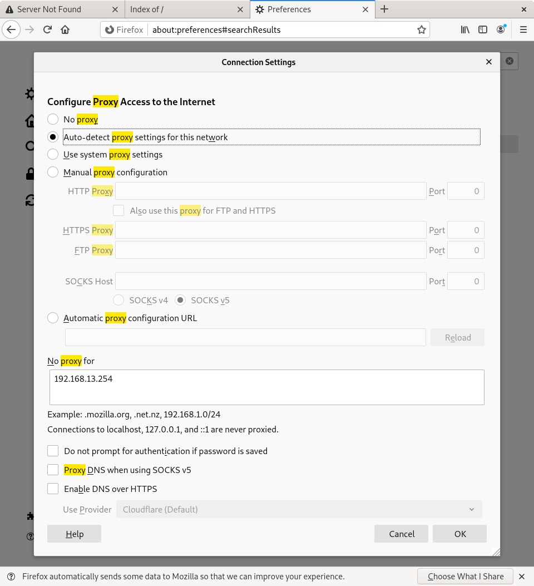
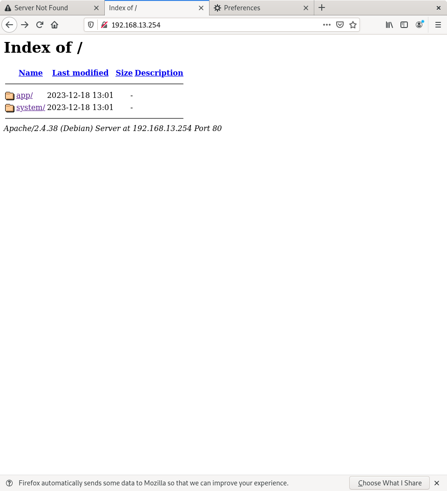
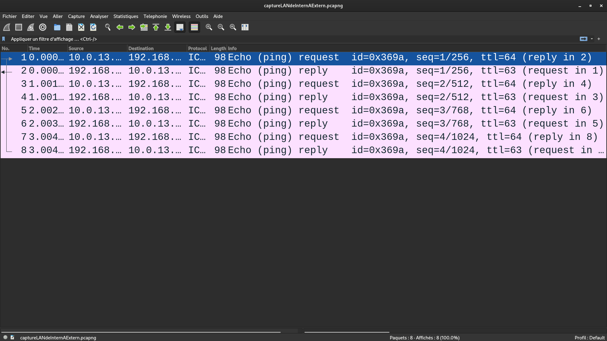
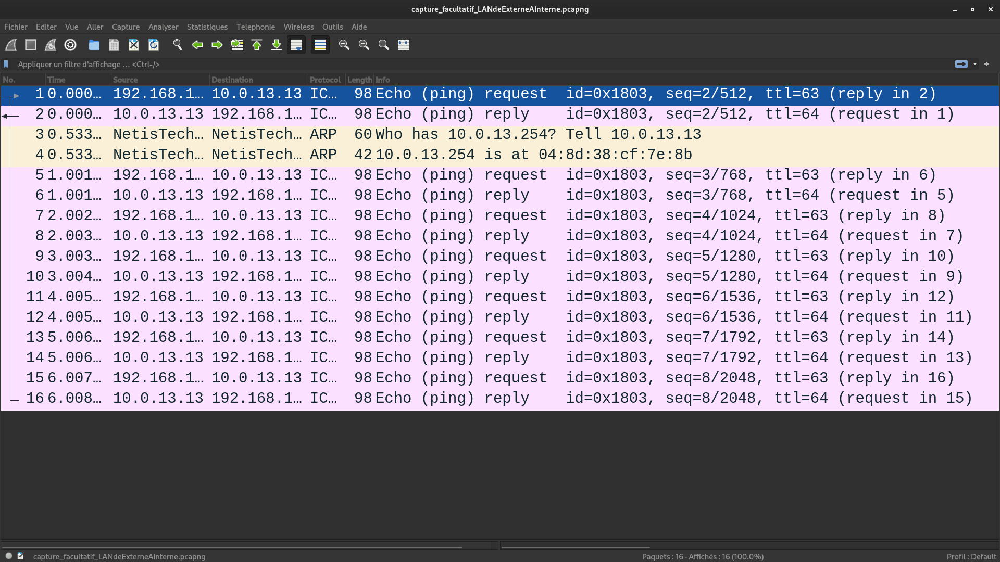
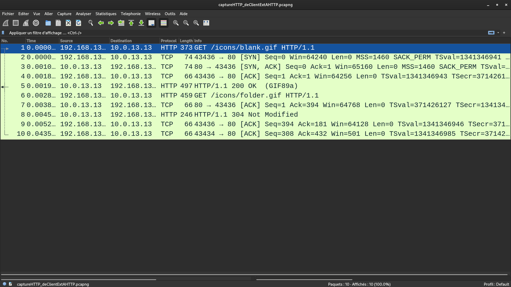
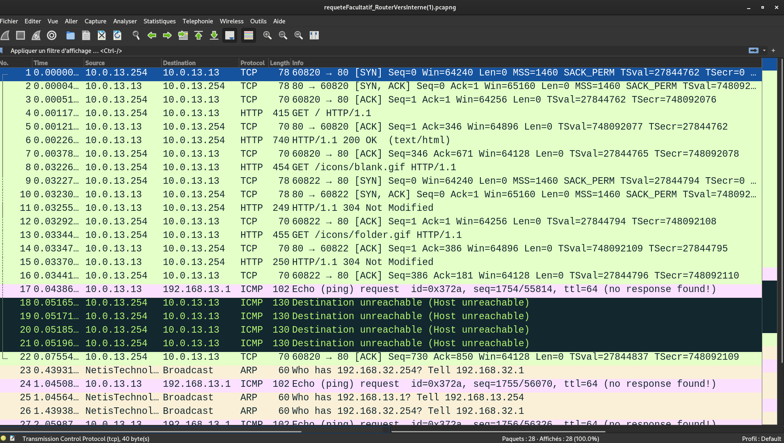

| Justine BERNIER | Basma MALKI | Clément PASQUET |
|-----------------|-------------|-----------------|
(Nous nous sommes mis à trois car le nombre d'élèves dans la classe est impaire.)

**Travail à réaliser**

Ci-dessous un schéma de l’organisation du réseau que vous aurez à mettre en place. Vous choisirez vos noms de machines qui remplaceront ROUTEUR, INTERNE et EXTERNE.


Interne (AKA ClientINT) : 10.0.13.13/24 dev jaune.13

La machine qui fera office de routeur aura deux adresses :
  * dans le réseau interne (AKA Routeur Interne) -> 10.0.13.254/24 dev jaune.13
  * dans le réseau externe (AKA Routeur Externe) -> 192.168.13.254/24 dev jaune

Externe (AKA ClientEXT) : 192.168.13.1/24 dev jaune


## But 

Le but est de mettre en place **un vlan**, **un serveur DHCP**, pour pouvoir facilement donner une configuration réseau, **un serveur DNS**, pour pouvoir utiliser des noms de domaines, et **un serveur HTTP**, dans le but d'y mettre notre projet de SAE.


## Mettre en place le VLAN :

Avant de commencer, nous devons mettre en place le VLAN sur la partie privée de notre réseau.

C'est le VLAN qui permettrait plus tard de donner une configuration réseau au client externe *grâce au serveur DHCP de routeur*.

Nous avons choisi de ne mettre en place *qu'un seul VLAN*, entre INTERNE et Routeur Interne.

Le but du VLAN ? Obliger les fluxs d'informations ( comme les connexions HTTP ) à passer par le PC du nom de ROUTEUR, simulant le fonctionnement d'un vrai routeur.

Ainsi, une machine extérieur devra passer par routeur pour afficher le site web de notre projet.


En premier, nous avons commencé par charger le module noyau nécessaire, en utilisant la commande suivante :
```shell
modprobe 8021q
```
Cela a permis <u>d'activer le support du VLAN</u> dans le noyau.

Ensuite, nous créérons une interface de type VLAN appelée jaune.13 sur la base de l'interface physique jaune. 

Cette opération s'effectue avec la commande :
```shell
ip link add link jaune name jaune.13 type vlan id 13
```
Pour l'utiliser, nous devons activer cette nouvelle interface :
```shell
ip link set jaune.13 up
```
Cela permet de mettre en service l'interface VLAN jaune.13. 

Chacune des machines connectées au VLAN doit recevoir une adresse IP *manuellement*. 

Pour le routeur, nous avons utilisé la commande :

```
ip a add 10.0.13.254/24 dev jaune.13
```
Et pour le client interne :
```
ip a add 10.0.13.13/24 dev jaune.13
```


## Pour la partie DHCP :
### Configuration du Forwarding IP :

En tout premier nous devons activer le forwarding, cela permettra aux paquets de "passer" par ROUTEUR :

Nous avons commencé par éditer le fichier de configuration ```sysctl``` en utilisant la commande :
```shell
sudo nano /etc/sysctl.conf
```

Nous avons ensuite décommenté la ligne suivante pour activer le forwarding IP :
```shell
...
#net.ipv4.ip_forward=1
```
Puis nous avons rechargé le fichier de conf :
```shell
sysctl -p /etc/sysctl.conf
```
Le résultat affiche la nouvelle configuration, notamment avec l'activation du forwarding IP :
```shell 
root@debian:/home/tdreseau# sysctl -p /etc/sysctl.conf
net.ipv4.ip_forward = 1
net.ipv6.conf.all.disable_ipv6 = 1
net.ipv6.conf.all.autoconf = 0
net.ipv6.conf.default.disable_ipv6 = 1
net.ipv6.conf.default.autoconf = 0
```
## Configuration du Serveur DHCP :
1. Modifier le fichier de configuration ```dhcpd.conf``` :

En utilisant ```sudo nano /etc/dhcp/dhcpd.conf```, à la fin du fichier, nous ajoutons la configuration pour le réseau VLAN jaune.13 :
```shell
subnet 10.0.13.0 netmask 255.255.255.0 {
  range 10.0.13.1 10.0.13.253;
  option domain-name-servers 10.0.13.254;
  option domain-name "serveur_dns13.com";
  option routers 10.0.13.254;
  host CLIENT {
      hardware ethernet 04:8d:38:cf:7e:8a;
      fixed-address 10.0.13.13;
   }
 }
```
Cela définit la **plage d'adresses IP attribuables**, le **serveur DNS**, le **nom de domaine**, le **routeur** et les **configurations spécifiques à l'hôte CLIENT** qui lui attribue son adresse IP en fonction de son adresse MAC.

2. Modifier le fichier de configuration **isc-dhcp-server** :

En utilisant la commande ```sudo nano /etc/default/isc-dhcp-server```, nous rajoutons l'interface avec laquel nous voudrons récuperer notre configuration réseau, dans notre cas jaune.13, le VLAN. 

Dans le fichier on rajoute l'interface voulue :
```
. . .
interfacesv4="jaune.13"
```
3. Redémarrer le service DHCP :

Après avoir effectué ces modifications, nous avons redémarré le service DHCP pour appliquer les changements :
```
systemctl restart isc-dhcp-server
```
Nous avons installé et configuré un serveur DHCP (paquet isc-dhcp-server). Comme indiqué juste au-dessus, celui-ci nous fournira un l'adresse du routeur interne, le **nom de domaine**, et **l’IP du serveur DNS**. 

L'hôte INTERNE doit se voir délivrer une **adresse fixe** en fonction de son adresse MAC.

**Routeur par défaut :** : ```option routers 10.0.13.254;```

**Nom de domaine** et **IP* à utiliser pour la résolution de noms :   ```option domain-name-servers 10.0.13.254;``` et ```option domain-name "serveur_dns13.com";```.

**Adresse fixe** de INTERNE : 
```shell
  option routers 10.0.13.254; // Route par défaut vers la machine routeur
    host CLIENT {
      hardware ethernet 04:8d:38:cf:7e:8a; // La machine avec CETTE adresse mac 
      fixed-address 10.0.13.13;            // Récupèrera CETTE IP
   }
```


## Pour la partie DNS :
Le DNS (Domain Name Service) est un système qui traduit les noms de domaine en adresses IP, facilitant la navigation sur Internet en utilisant des noms conviviaux au lieu de mémoriser des adresses numériques.

Ajout des permissions à ```/var/cache``` avec : 
```shell 
sudo chown bind:bind /var/cache/*
```

Dans ```/etc/bind/sae_dns13.db``` on crée un nouveau fichier avec :
```
/etc/bind/sae_dns13.db
```
On rajoute les lignes suivantes :
```shell
$ttl 38400
@       IN      SOA     ns13.serveur_dns13.com. postmaster.ns13.sae_dns13.com. (
                1       ; Numero de serie, à incrementer a chaque modification
                10800   ; Rafraichissement
                3600    ; Nouvel essai apres 1 heure
                604800  ; Obsolescence apres 1 semaine
                86400 ) ; TTL minimale de 1 jour

           IN    NS     ns13.serveur_dns13.com.
ns13       IN    A      192.168.13.254
www        IN    CNAME  ns13.serveur_dns13.com.
routeur    IN    CNAME  ns13.serveur_dns13.com.
```

* La première section (```@ IN SOA...```) est l'enregistrement de la zone qui spécifie les *informations sur le domaine*.
* ```IN NS ns13.serveur_dns13.com``` -> déclare le *serveur de noms* principal pour la zone.
* ```ns13 IN A 10.0.13.254``` -> spécifie *l'adresse IP du serveur*.
* ```www IN CNAME interne.ns13.serveur_dns13.com``` -> crée *un alias* (CNAME) pour le nom www, pointant vers interne.ns13.sae_dns13.com.
* ```interne IN A 10.0.13.13``` et ```routeur IN A 10.0.13.254``` -> définissent les *adresses IP d'autres hôtes*.

Nous avons redemmaré le service BIND, cela permet d'appliquer les modifications apportées au fichier de zone.
```
sudo systemctl restart bind9
```
On test que ca fonctionne avec la commande suivante :
```
nslookup www.ns13.sae_dns13.com
```
Nous éditons le fichier named.conf pour inclure la nouvelle zone serveur_dns13.com :
```
sudo nano /etc/bind/named.conf
```
On modifie le fichier pour rajouter une nouvelle zone :
```shell
...
include "/etc/bind/named.conf.options"; include "/etc/bind/named.conf.local"; include "/etc/bind/named.conf.default-zones";

zone "serveur_dns13.com" in { // déclaration de la zone

  type master; // déclaration type maître
  file "/var/cache/bind/sae_dns13.db"; // Chemin du fichier };
```

Rajout du nom de domaine sur les **autres** PC avec ```nano /etc/resolv.conf``` : 
```shell 
...
nameserver 10.0.13.254
```

Nous redémarrons le service BIND et utilisons la commande suivante pour tester la connexion au site :
```shell
sudo systemctl restart bind9
```
```shell
nslookup www.ns13.sae_dns13.com
```
La sortie terminal devrait afficher :
```shell
ns13.serveur_dns13.com has address 192.168.13.254
```
Ensuite, pour faire une délégation, nous avons ajouté au fichier sae_dns13.db ceci :
serveur_dns13.com.       IN    NS     ns13.serveur_dns13.com.
ns13.serveur_dns13.com.  IN    A      192.168.13.254

## Pour la partie HTTP :

Nous avons créé un fichier de configuration ```monsite.conf``` pour notre site avec la commande suivante :
 ``` 
 nano /etc/apache2/site-available/monsite.conf 
 ```
Dans le fichier de configuration monsite.conf :
```shell
<VirtualHost *:80>
  ServerAdmin webmaster@monsite.com
  DocumentRoot /var/www/html
  DirectoryIndex index.html
  <Directory /var/www/html>
    Options Indexes FollowSymLinks
    AllowOverride All
    Require all granted
  </Directory>
</VirtualHost>
```
Nous avons configuré un virtual host pour écouter sur le *port 80*, défini le *répertoire racine*, et spécifié certaines options pour le répertoire.

On active le site en utilisant la commande :
```shell
a2ensite monsite.conf
```

Et enfin on redémarre le service Apache :
```shell
systemctl restart apache2
```
Ensuite nous allons **télécharger** notre MVC grâce à la commande suivante :
```shell
wget https://gitlab.univ-nantes.fr/pub/but/but2/r3.01/r3.01/-/archive/main/r3.01-main.zip?path=td/workspace
```

Nous allons dans le dossier et copions /app et /system dans /var/www/html :
```shell 
sudo cp -r ./* /var/www/html
```

Pour pouvoir tester depuis d'autres machines, il faut faire en sorte de ne pas passer par le proxy ( le proxy étant paramétré pour refuser de faire passer la requête ). 

Dans les préférences du proxy, nous avons rajouté dans la catégorie "noproxy for"  : "10.0.13.13"


Pour pouvoir permettre au machines extérieurs d'accéder à la page PHP, nous devons rediriger le flux du port 80 du **serveur** vers la bonne ip, grâce a une command iptables sur le routeur : 
```shell
sudo iptables -t nat -A PREROUTING -p tcp --dport 80 -j DNAT --to-destination 10.0.13.13:80
```




Finalement, nous devons mettre en place des routes pour permettre a des machines extérieurs d'acceder a notre serveur HTTP : 
```ip route add 192.168.13.0/24 via 192.168.13.254```
( sur la machine routeur )

```ip route add 192.168.13.0/24 via 10.0.13.254```
( sur la machine interne, qui détient le serveur HTTP )

<a id="lienIpRoute">```ip route add 10.0.13.0/24 via 192.168.13.254```</a>
( sur la machine extérieur )

Puis, il faut faire une requête HTTP avec l'adresse du site pour pouvoir y accéder. La requete est envoyé à l'adresse précisée (adresse routeur externe AKA adresse pour accéder au site sur le réseau), le serveur lorsqu'il reçoit la requête redirige le flux du port 80 vers la bonne ip, grâce a la commande iptables sur le routeur.


Toutes ces commandes permettent d'accéder au serveur HTTP, et donc, a notre site web, en passant par le serveur.
Il est par contre nécessaire, pour toute machine extérieur au réseau, de rajouter [la route correspondante](#lienIpRoute).

<br>
### Test envoie de paquets entre réseaux

Nous pouvons faire cela avec toutes les requêtes, notamment celles pour ping : 


Nous pouvons voir que les ping se basent sur une méthode de "ping-pong"; les pings sont envoyés, puis ils attendent une réponse.

Cette requête sert à démontrer que **INTERNE peut accéder à l'extérieur**.

<br>

Dans le même principe, voici un capture d'écran supplémentaire qui prouve l'inverse, *une machine extérieur peut accéder à INTERNE* :

L'envoie de paquets s'effectue bien entre la machine interne et la machine externe.
#### Test requête HTTP
Ici nous pouvons voir les différents paquets envoyés **lorsque la machine extérieur au réseau souhaite accéder au serveur HTTP** :


Finalement, voici une capture d'écran montrant les différents paquets envoyés quand *ROUTEUR accède à la page web de INTERNE* :



## Conclusion

En ensemble, nous avons exploré la mise en place de différentes composantes essentielles : 
* Un **VLAN** : 
offrant ainsi la possibilité de subdiviser notre réseau physique en sous-réseaux virtuels distincts.
* Un **DHCP** :
permettant d'automatiser la configuration réseau des périphériques connectés. En outre, nous avons pris avantage de cette fonction pour attribuer une adresse IP fixe à la machine Interne.
* Un **DNS** : 
simplifiant l'utilisation des noms de domaine, plutôt que de mémoriser des adresses IP complexes, les utilisateurs peuvent désormais accéder à des ressources réseau en utilisant des noms simples, améliorant ainsi l'expérience utilisateur.
* Un **Serveur HTTP** :
constituant une étape cruciale pour rendre accessible notre projet de SAE. Grâce à cette configuration, notre site web peut être consulté via un navigateur et sur toute les machines de nos réseaux interne et externe.

En conclusion, notre travail a abouti à la mise en place réussie d'un réseau fonctionnel comprenant un VLAN, un serveur DHCP, un serveur DNS, et enfin, un serveur HTTP permettant l'accès à notre projet de SAE. 

*Ces étapes ont renforcé l'accessibilité de notre site web et ont constitué une opportunité d'améliorer nos compétences en gestion réseau.*
