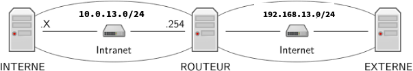

**Travail à réaliser**

Ci-dessous un schéma de l’organisation du réseau que vous aurez à mettre en place. Vous choisirez vos noms de machines qui remplaceront ROUTEUR, INTERNE et EXTERNE.



**DNS**

Choisissez un nom de domaine dans .com. Votre serveur DNS gérera a minima les noms suivants : ROUTEUR, www qui sera un alias d'une autre machine. Vous fournirez également la procédure et le(s) fichier(s) pour faire une délégation depuis le serveur de .com

**VLAN**

Mettez en place un VLAN sur la partie privée de votre réseau.

**DHCP**

Installez et configurez un serveur DHCP (paquet isc-dhcp-server). Celui-ci fournira une route par défaut vers la machine ROUTEUR, le nom de domaine, et l’IP du serveur DNS. L'hôte CLIENT doit se voir délivrer une adresse fixe en fonction de son adresse MAC.

**HTTP Autre**

Vous pouvez compléter votre configuration par les éléments de votre choix (filtrage, services supplémentaires, ...)

**Rendu**

Rédiger un document (rapport.md) expliquant vos choix. Vous fournirez également : - des captures de trames démontrant le bon fonctionnement de votre réseau. En particulier, une capture de trame faite sur le ROUTEUR d'une requête HTTP émise depuis l'extérieur et une capture montrant que CLIENT peut accéder au LAN. - le résultat des commandes ./log > MACHINE.log, où MACHINE correspond à la machine sur laquelle doit être exécutée la commande avec les droits root, et doit être remplacée successivement par CLIENT et ROUTEUR

Interne : 10.0.13.13/24 dev jaune
Routeur : 10.0.13.254/24 dev jaune et 
Externe : 192.168.13.1/24 dev jaune


## Mettre en place la vlan :

Avant de commencer, il faut mettre en place le VLAN, qui permettrait, plus tard, de donner une configuration réseau au client externe grace au serveur DHCP de routeur.

Installer le module noyau nécessaire :
```
modprobe 8021q
```
Rajouter la vlan :
```
ip link add link jaune name jaune.13 type vlan id 13
```
“Démarrer” la vlan :
```
ip link set jaune.13 up
```
Et **chaque machine** doit s’attribuer manuellement une ip :
( pour le routeur )
```
ip a add 10.0.13.254/4 dev jaune.13
```
( pour le client )
```
ip a add 10.0.13.13/4 dev jaune.13
```

## Pour la partie DHCP :

En tout premier nous devons activer le forwarding : 

Il faut en premier modifier le fichier de conf. :
```
sudo nano /etc/sysctl.conf
```

Il faut ensuite décommenter la ligne suivante, qui sert à activer l'ip forwarding :
```
#net.ipv4.ip_forward=1
```


Puis il faut recharger le fichier de conf. :
```
sysctl -p /etc/sysctl.conf
```

Le résultat devrait ressembler à cela :
```bash 
root@debian:/home/tdreseau# sysctl -p /etc/sysctl.conf
net.ipv4.ip_forward = 1
net.ipv6.conf.all.disable_ipv6 = 1
net.ipv6.conf.all.autoconf = 0
net.ipv6.conf.default.disable_ipv6 = 1
net.ipv6.conf.default.autoconf = 0
```

Avec la commande ```sudo nano /etc/dhcp/dhcpd.conf```, à la fin du fichier, nous rajoutons :
```bash
subnet 10.0.13.0 netmask 255.255.255.0 {
  range 10.0.13.1 10.0.13.253;
  option domain-name-servers 10.0.13.254;
  option domain-name "serveur_dns13.com";
  option routers 10.0.13.254;
  host CLIENT {
      hardware ethernet 04:8d:38:cf:7e:8a;
      fixed-address 10.0.13.13;
   }
 }
```
Dans ```/etc/default/isc–dhcp-server``` nous rajoutons l'interface avec laquel nous voudrons recuperer notre configuration réseau, dans notre cas le VLAN donc jaune.13 :
```
sudo nano /etc/default/isc-dhcp-server
```
Dans le fichier on modifie :
```
. . .
interfacesv4="jaune.13"
```

On redémarre le service :
```
sudo systemctl restart isc-dhcp-server
```


## Pour la partie DNS :

Dans /etc/bind\_sae\_dns13.db on crée un nouveau fichier avec :
```
/etc/bind/sae_dns13.db
```
On rajoute les lignes suivantes :
```bash
$ttl 38400
@       IN      SOA     ns13.serveur_dns13.com. postmaster.ns13.sae_dns13.com. (
                1       ; Numero de serie, a incrementer a chaque modification
                10800   ; Rafraichissement
                3600    ; Nouvel essai apres 1 heure
                604800  ; Obsolescence apres 1 semaine
                86400 ) ; TTL minimale de 1 jour

         IN    NS    ns13.serveur_dns13.com.
ns13     IN    A     192.168.13.254
www      IN    CNAME  ns13.serveur_dns13.com.
routeur  IN    CNAME  ns13.serveur_dns13.com.


```

On redemarre Bind9 :
```
sudo systemctl restart bind9
```
On test que ca fonctionne avec la commande suivante :
```
nslookup www.ns13.sae\_dns13.com
```
Et maintenant on modified named.conf avec :
```
sudo nano /etc/bind/named.conf
```
On modifie le fichier pour rajouter une nouvelle zone :
```bash
include "/etc/bind/named.conf.options"; include "/etc/bind/named.conf.local"; include "/etc/bind/named.conf.default-zones";

zone "serveur_dns13.com" in { // déclaration de la zone

  type master; // déclaration type maître
  file "/var/cache/bind/sae_dns13.db";// on indique le fichier contena$ };
```
```
nano /etc/resolv.conf
```

## Pour la partie HTTP :

Créer un fichier de configuration : ``` nano /etc/apache2/site-available/monsite.conf ```
Dans le fichier de configuration monsite.conf :
```bash
<VirtualHost *:80>
  ServerAdmin webmaster@monsite.com
  DocumentRoot /var/www/html
  DirectoryIndex index.html
  <Directory /var/www/html>
    Options Indexes FollowSymLinks
    AllowOverride All
    Require all granted
  </Directory>
</VirtualHost>
```

Pour pouvoir activer ce site il faut faire la commande :
```bash
sudo a2ensite monsite.conf
```

Et enfin :
```bash
systemctl restart apache2
```
Ensuite nous allons télécharger notre MVC grâce à la commande suivante :
```bash
wget https://gitlab.univ-nantes.fr/pub/but/but2/r3.01/r3.01/-/archive/main/r3.01-main.zip?path=td/workspace
```

Nous allons dans le dossier et copions /app et /system dans /var/www/html :
```sudo cp -r \* /var/www/html```


